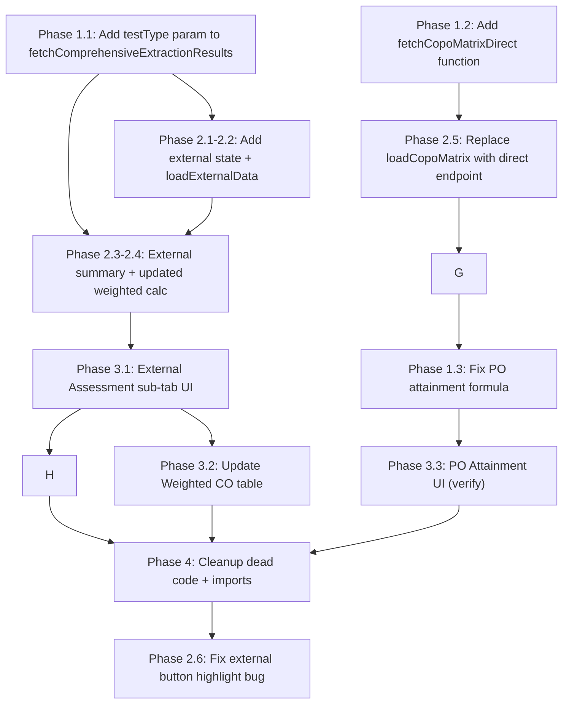
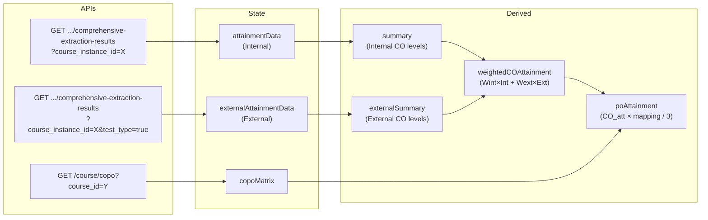

# CO/PO Attainment Refactor — Detailed Analysis Plan

## Overview

Refactor `CourseAttainmentReport.tsx` and `attainmentReportService.ts` to support four sub-tabs:

| Sub-Tab | Data Source | Key Behavior |
|---|---|---|
| **Internal Assessment** | Existing API (default) — includes `direct_assessments` | Already working. Shows CIA tests + assignment marks. |
| **External Assessment** | Same API with `&test_type=true` — returns data **without** `direct_assessments` | New. Same spreadsheet layout, but external-only tests. |
| **Weighted CO Attainment** | Computed from Internal + External attainment levels | Uses `Wint × Internal + Wext × External` formula. |
| **PO Attainment** | CO-PO matrix from `/course/copo?course_id=#` + weighted CO values | `PO = avg(CO_attainment × mapping_value / 3)` |

---

## Phase 1 — Service Layer Changes

### File: [`attainmentReportService.ts`](file:///c:/D/neurobe_1/neurobeFrontend/services/attainmentReportService.ts)

### 1.1 Add `testType` parameter to `fetchComprehensiveExtractionResults`

**Current** (L525-555):
```ts
export const fetchComprehensiveExtractionResults = async (
  courseId?: string | number,
  courseInstanceId?: string | number | null
): Promise<ComprehensiveExtractionResponse> => {
  // builds: ?course_instance_id=X
```

**Change**: Add optional `testType?: boolean` parameter:
```ts
export const fetchComprehensiveExtractionResults = async (
  courseId?: string | number,
  courseInstanceId?: string | number | null,
  testType?: boolean  // when true, appends &test_type=true
): Promise<ComprehensiveExtractionResponse> => {
```

Modify the URL construction:
```ts
const params = new URLSearchParams();
if (courseInstanceId != null && courseInstanceId !== "") {
  params.set("course_instance_id", String(courseInstanceId));
}
if (testType === true) {
  params.set("test_type", "true");
}
const queryStr = params.toString() ? `?${params.toString()}` : "";
```

> [!IMPORTANT]
> When `test_type=true`, the backend returns the same response shape but with **no `direct_assessments`** on each student. The `normalizeComprehensiveExtractionData` function already handles missing `direct_assessments` gracefully (the assignment test block is skipped when no data exists), so no normalization changes are needed.

### 1.2 Add `fetchCopoMatrixDirect` function

New function that calls `/course/copo?course_id=#` directly via `commonInstance()`:

```ts
export const fetchCopoMatrixDirect = async (
  courseId: string | number
): Promise<COPOMatrixData | null> => {
  try {
    const res = await commonInstance().get(`course/copo?course_id=${courseId}`);
    const data = Array.isArray(res.data) ? res.data : [res.data];
    // Find the active one (is_active === true)
    const active = data.find((d: any) => d.is_active === true);
    if (active && active.matrix_entries) {
      return {
        copo_id: active.copo_id,
        matrix_entries: active.matrix_entries,
      };
    }
    // Fallback: first one with matrix_entries
    const withEntries = data.find((d: any) => d.matrix_entries?.length > 0);
    if (withEntries) {
      return {
        copo_id: withEntries.copo_id,
        matrix_entries: withEntries.matrix_entries,
      };
    }
    return null;
  } catch (err) {
    console.warn("[AttainmentService] Failed to fetch COPO matrix:", err);
    return null;
  }
};
```

### 1.3 Update `calculatePOAttainment` formula

**Current** (L454-520): Uses `weightedSum / totalWeight` (weighted average).

**Required**: The user specifies: `multiply the CO attainment with CO PO mapping value and divide by 3, then show the average of all the PO values`.

Formula per PO:
```
PO_attainment = avg( (CO_attainment × mapping_value) / 3 ) for all mapped COs
             = Σ((CO_attainment × mapping_value) / 3) / count_of_mapped_COs
```

**Change** in `calculatePOAttainment`:
```diff
- weightedSum += coAtt * mappingVal;
- totalWeight += mappingVal;
+ weightedSum += (coAtt * mappingVal) / 3;
+ totalWeight += 1; // count of contributing COs
```

Result: `attainmentValue = weightedSum / totalWeight` = average of `(CO_att × mapping) / 3`.

---

## Phase 2 — Component State Changes

### File: [`CourseAttainmentReport.tsx`](file:///c:/D/neurobe_1/neurobeFrontend/components/academic-setup/CourseAttainmentReport.tsx)

### 2.1 New State Variables

```ts
// External assessment data (fetched with test_type=true)
const [externalAttainmentData, setExternalAttainmentData] = 
  useState<NormalizedAttainmentData | null>(null);
const [loadingExternal, setLoadingExternal] = useState<boolean>(false);
```

### 2.2 New Data Loader: `loadExternalData`

A function similar to `loadExtractionData` but calls with `testType=true`:

```ts
const loadExternalData = async () => {
  setLoadingExternal(true);
  try {
    const activeCourseId = courseId || 1;
    const instId = selectedInstanceId || offeringId || 1;
    
    const raw = await fetchComprehensiveExtractionResults(
      activeCourseId, instId, true // test_type=true
    );
    
    const normalized = normalizeComprehensiveExtractionData(
      raw, targetPercentage, ""
    );
    
    // Overlay course metadata
    if (courseMetadata || courseDetail) { /* same overlay logic */ }
    
    setExternalAttainmentData(normalized);
  } catch (err) {
    console.error("Failed to load external extraction results:", err);
  } finally {
    setLoadingExternal(false);
  }
};
```

**Trigger**: Load when component mounts and when `selectedInstanceId` changes (same as internal):
```ts
useEffect(() => {
  if (selectedInstanceId !== null) {
    loadExtractionData(selectedInstanceId);
    loadExternalData();
  }
}, [selectedInstanceId, courseId]);
```

### 2.3 External Assessment Summary (derived)

```ts
const externalSummary: AttainmentCalculationSummary | null = useMemo(() => {
  if (!externalAttainmentData) return null;
  return calculateComprehensiveAttainment(externalAttainmentData, targetPercentage);
}, [externalAttainmentData, targetPercentage]);
```

### 2.4 Updated Weighted CO Attainment Calculation

The weighted CO attainment should combine **internal attainment levels** and **external attainment levels**:

```ts
const weightedCOAttainment = useMemo(() => {
  if (!summary) return [];
  
  // Get all COs from whichever dataset has them
  const allCos = attainmentData?.cos || [];
  
  return allCos.map((co) => {
    const internalLevel = summary.cos_summary[co]?.attainment_level || 0;
    const externalLevel = externalSummary?.cos_summary[co]?.attainment_level || 0;
    
    const total = Number(
      (weightInternal * internalLevel + weightExternal * externalLevel).toFixed(2)
    );
    
    return {
      co,
      internal_attainment: internalLevel,
      external_attainment: externalLevel,
      total_attainment: total,
    };
  });
}, [summary, externalSummary, weightInternal, weightExternal, attainmentData]);
```

> [!NOTE]
> This replaces the old `calculateWeightedCOAttainment` service call since the old function mixed in `direct_assessment_attainment` and `external_exams` from the response body. Now internal and external are from separate API calls.

### 2.5 Replace `loadCopoMatrix` with direct endpoint

Replace the `Models.copo.get_active` / `Models.copo.list` fallback chain with the new direct call:

```ts
const loadCopoMatrix = useCallback(async () => {
  const activeCourseId = courseId || 1;
  setLoadingCopo(true);
  try {
    const matrix = await fetchCopoMatrixDirect(activeCourseId);
    if (matrix) setCopoMatrix(matrix);
  } catch (err) {
    console.warn("Could not load CO-PO matrix:", err);
  } finally {
    setLoadingCopo(false);
  }
}, [courseId]);
```

### 2.6 Fix External Assessment sub-tab button highlight

**Current bug** (L390): The external button uses `subTab === "internal"` for its active class instead of `subTab === "external"`:
```tsx
className={`... ${subTab === "internal"  // ← BUG
```
**Fix**: `subTab === "external"`.

---

## Phase 3 — UI Changes

### 3.1 External Assessment Sub-Tab Content

Render the **same spreadsheet layout** as the Internal Assessment tab, but using `externalAttainmentData` and `externalSummary` instead of `attainmentData` and `summary`.

```tsx
{subTab === "external" && (<>
  {loadingExternal ? (
    <LoadingSpinner message="Loading external assessment data..." />
  ) : !externalAttainmentData ? (
    <EmptyState message="No external assessment data available" />
  ) : (
    <>
      {/* CO KPI Cards — same as internal but using externalSummary */}
      {/* Main Spreadsheet Table — same as internal but using externalAttainmentData */}
      {/* Summary Rows — same as internal but using externalSummary */}
    </>
  )}
</>)}
```

> [!TIP]
> To avoid 800+ lines of duplicated JSX, extract the internal assessment spreadsheet into a reusable sub-component:
> ```tsx
> const AttainmentSpreadsheet = ({ data, summary, targetPercentage, ... }) => (...)
> ```
> Then use it in both `subTab === "internal"` and `subTab === "external"`.

### 3.2 Weighted CO Attainment Sub-Tab Updates

Update the table columns to use the new simplified structure:

| CO | Internal Attainment (Level 0-3) | External Attainment (Level 0-3) | Weighted Total |
|---|---|---|---|
| CO1 | `summary.cos_summary[co].attainment_level` | `externalSummary.cos_summary[co].attainment_level` | `Wint × Internal + Wext × External` |

Remove the "Direct Assessment" and "Combined Internal" columns since they're no longer part of the weighted calculation. The Direct Assessments are already included within the Internal Assessment tab's data.

### 3.3 PO Attainment Sub-Tab

No major UI changes needed — the existing PO cards and breakdown table already work. Just ensure:
1. The CO-PO matrix is fetched from the new endpoint
2. The PO formula uses `(CO_att × mapping) / 3` averaged across mapped COs

---

## Phase 4 — Cleanup

### 4.1 Remove Dead Code

After the refactor, these become unused and should be removed:

| Item | Location | Reason |
|---|---|---|
| `instances` state | L77 | No instance dropdown anymore (user removed it) |
| `courseDetail` state | L79 | Was for the removed instance dropdown |
| `direct_assessment_attainment` in `WeightedCOAttainment` | Service | No longer needed |
| `combined_internal` in `WeightedCOAttainment` | Service | No longer needed |
| `handleInstanceChange` | Component | Already removed by user |
| `Layers` import | Component | Was used by removed instance dropdown |
| `ExternalLink` import | Component | Not used |
| `Sparkles` import | Component | Not used |
| `Award` import | Component | Not used |

### 4.2 Remove Unused Imports

Clean up lucide-react imports that are no longer referenced after the UI changes.

---

## Execution Order



---

## Data Flow Summary



---

## Risk / Edge Cases

> [!WARNING]
> **Mismatched COs between internal and external**: Internal may have COs from `direct_assessments` (CO1-CO5) while external may only have CO1-CO3. The weighted calculation must handle missing COs gracefully (treat missing as level 0).

> [!NOTE]
> **Empty external response**: When `test_type=true` returns no students or no tests, `externalAttainmentData` will have empty arrays. The UI should show an "No external assessment data available" empty state.

> [!NOTE]
> **COPO matrix with zero mapping values**: The response includes entries with `matrix_value: 0`. The PO calculation already filters these out (L493: `if (mappingVal === 0) return`).
